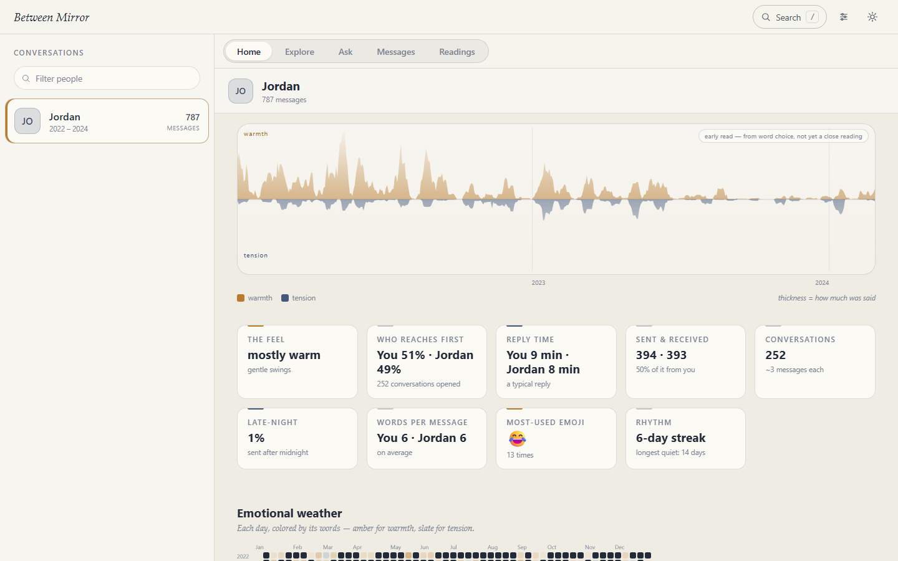
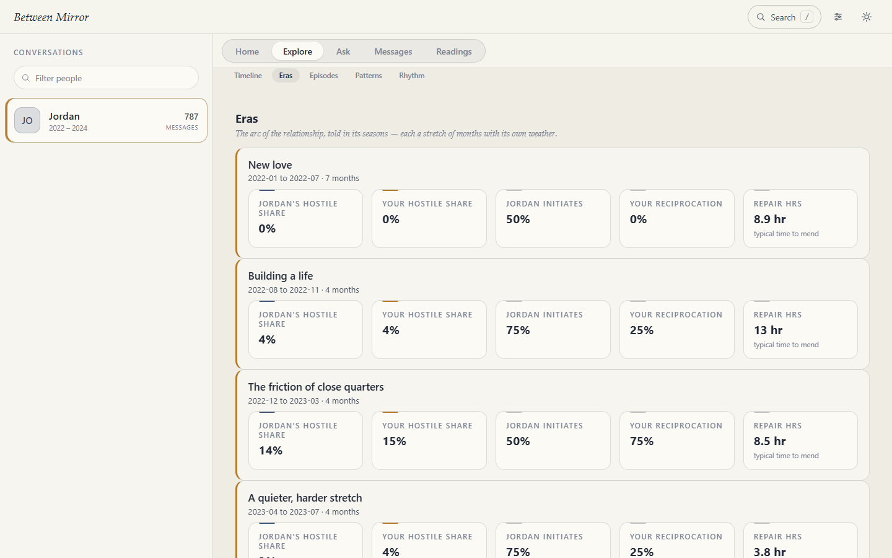
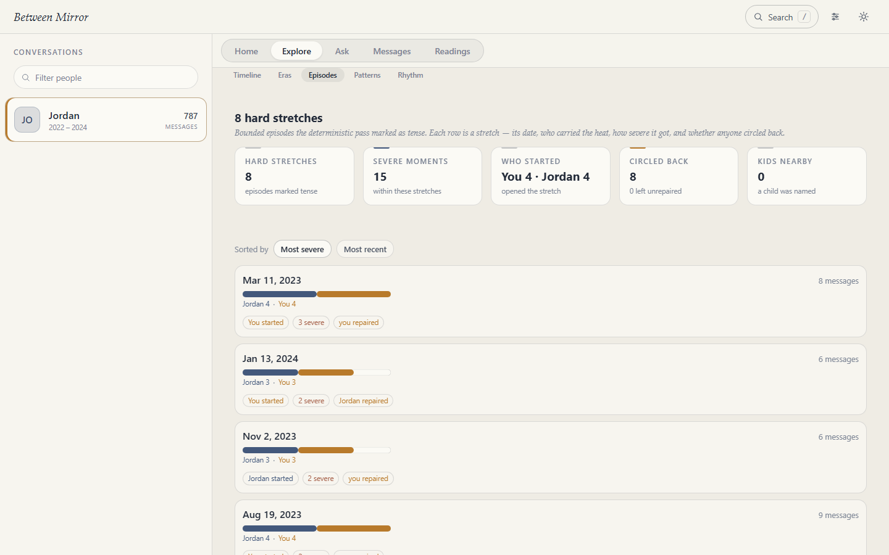
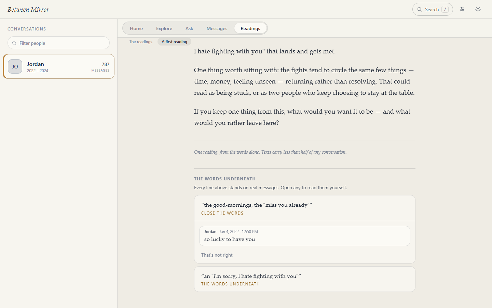
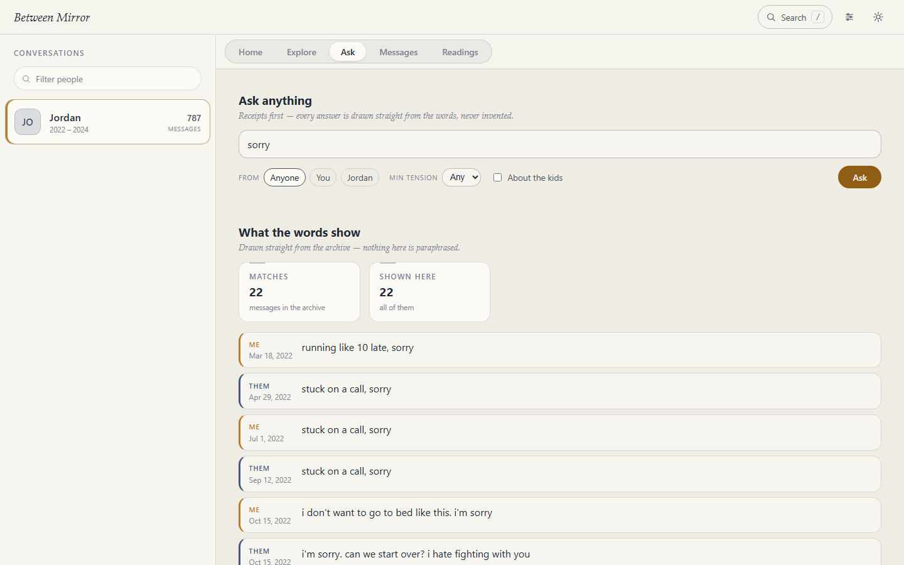
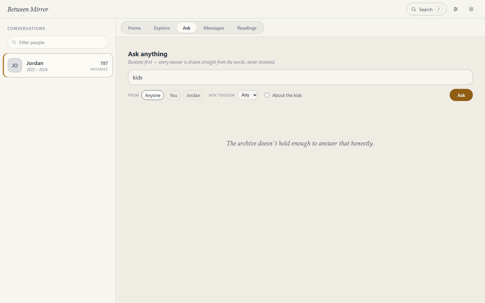
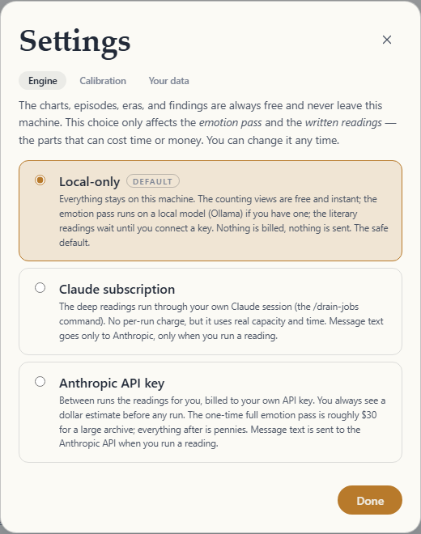

# Between Mirror

[](https://github.com/between-mirror/between/actions/workflows/ci.yml)



**Between Mirror turns years of messages into a private, explorable relationship history — with the words underneath every observation.**

- 🔒 **Local-first, and enforced.** The server refuses to boot off loopback. Your archive stays on your computer. Deterministic views never send message text anywhere; optional written readings use only the model path you explicitly choose.
- 🧾 **Receipts under every claim.** Every observation the model authors carries the messages it came from, or it doesn't get shown.
- ⚖️ **AGPL, no telemetry — checked by CI.** Inspectable by anyone, on Windows and Linux, on every push to `main` and every pull request.

**Four ways in:**

| | |
|---|---|
| **Click through it now** | [The browser demo](https://between-mirror.github.io/between/demo/) — the real application reading a made-up couple's archive, Alex & Jordan. Nothing to install, nothing of yours involved, and it talks to nothing but that page. |
| **Run the demo locally** | `npm run demo:serve` — the same fictional couple, with the writes switched on. |
| **Official installer** | Signed, one-click, no terminal. Not built yet — [waitlist](https://github.com/between-mirror/between/discussions/1) |
| **Build from source** | Node 22+, five minutes, [below](#build-from-source) |

**Or just look:** [between-mirror.github.io/between](https://between-mirror.github.io/between/) — what it shows, what it refuses to claim, and what it does *not* protect you from.

Today it reads **Android SMS Backup & Restore** exports. iPhone/iMessage is not supported yet — [docs/STATUS.md](docs/STATUS.md) is the authority on what is implemented, what is experimental, and what is only designed.

---

## What you actually see

**The years, as weather.** Warmth above the line, tension below, thickness for how much was said. It reads left to right like a life does.

**Seasons, named.** The arc broken into eras — each a stretch of months with its own temperature, its own rhythm of rupture and repair.



**The hard stretches, listed.** Episodes are the rough patches the deterministic pass marked as tense: when, who carried the heat, how severe it got, and whether anyone circled back. Every row opens the actual messages.



### The whole discipline, in one screenshot

Every line in a reading stands on real messages. Open any claim and the words are right there — with *"That's not right"* beside them, because you were there and the model wasn't.



This is the part that matters most. A model that can write beautifully about your marriage without showing you what it read is not an instrument, it's a horoscope. So: **the model may only emit claims that carry evidence ids**, each id must resolve to a real message or the claim is dropped, and even the connective sentences between paragraphs are written by the app from fixed templates — so there is nothing in a reading that isn't either receipted or deliberately empty of content.

### Ask, and be told when the answer isn't there





The second screenshot is not a bug. Asked about something this archive does not hold, it declines instead of inventing — which is the entire difference between a mirror and a fortune teller. Both behaviours matter, so both are shown.

### You decide what, if anything, leaves the machine



The counting — river, episodes, eras, patterns, exports — is **free forever and never leaves your computer**. Only the written readings need a model, and you choose which one, with the cost stated before anything runs. The safe default is local-only.

No hosted archive, no application accounts, and no telemetry. Off-device model use is explicit and opt-in.

*Every image above is the real application reading the fictional demo couple. The author's own archive is user zero and is never the demo, the screenshot, or the case study.*

## Privacy — read before you touch git

This repo contains **code, prompts, specs, and de-personalized docs — never message content or the archive.**

- The SMS/MMS backup (`*.xml`), any database (`*.db` / `*.sqlite`), decoded media, and the `jobs/` · `results/` transport are **git-ignored** — keep it that way.
- Keep the working copy **out of cloud-synced folders** (OneDrive, Dropbox) — the app warns loudly at boot if it looks synced.
- The most sensitive data a consumer app can hold lives next to this repo — treat it accordingly.

The non-negotiables are written down and enforced by tests: [docs/PRIVACY-INVARIANTS.md](docs/PRIVACY-INVARIANTS.md). What local-first does **not** protect you from is written down too: [docs/THREAT-MODEL.md](docs/THREAT-MODEL.md).

## Get your messages out of your phone

You produce the input yourself, on the Android phone that has the conversation. Nothing goes to a cloud service.

1. On the Android phone, install **SMS Backup & Restore** (SyncTech) from the Google Play Store.
2. Open it and choose **Set up a backup** (or **Backup**). Include **Messages**; media (MMS) can be included or skipped.
3. For the destination, pick **local storage on the phone** — export to a file, **not** to Google Drive / Dropbox / any cloud. The backup is written as an XML file named like `sms-YYYYMMDDHHMMSS.xml`.
4. Copy that file off the phone to this PC (USB cable, or a local transfer you trust). Keep it off cloud-synced folders.
5. Drop the file into this repo's **`data/`** folder. That's the archive Between Mirror reads.

**iPhone / iMessage is not supported yet.** The parser has no path for an iPhone backup, and iMessage/RCS traffic isn't in an Android SMS archive at all (the tool flags the resulting gaps rather than guessing). If both people were on iPhone, the archive won't exist.

## Build from source

Get [Node.js](https://nodejs.org) **22 or newer**, then, from the repo folder:

```powershell
npm ci                                                    # exact versions from the lockfile
npx tsx server/src/cli/ingest.ts "data\sms-XXXX.xml"     # builds between.db (git-ignored)
npm run dev                                               # API :5274 + web :5273  → browse + metrics + river

# on-demand deep analysis (the airlock — capacity-metered, you trigger it). Pick a thread id from the UI:
npx tsx server/src/cli/analyze.ts --thread <id> --dry-run          # see the capacity estimate first
npx tsx server/src/cli/analyze.ts --thread <id>                    # materialize the L1 jobs
npx tsx server/src/cli/drain.ts   --loop                          # Ollama reads the grunt (local, free)
npx tsx server/src/cli/reflect.ts --thread <id> --engine claude   # the worthwhile letter (Claude/Fable)
```

> **Node 22 is the floor, not a suggestion.** On Windows, `better-sqlite3` publishes no prebuilt binary for Node 20, so installing there would need a full MSVC C++ toolchain. (Node 20 also reached end-of-life in April 2026.)

> **`npx tsx …`, not `npm run … -- --flags`.** On Windows, `npm run <script> -- --flags` silently drops the `--`-prefixed flags (npm parses them as its own config), so `--thread`/`--from`/`--dry-run` never reach the CLI. `npm run dev` (no flags) is fine.

The counting views need no model and no network. The deep readings run through a local Ollama model, your Claude subscription, or your own API key — your choice, in Settings, with the cost shown first.

**The full runbook and the engine tiers live in [docs/DEPLOY.md](docs/DEPLOY.md).**

## The documents

- **Run it → [docs/DEPLOY.md](docs/DEPLOY.md).** Prerequisites, the phone export, ingest, browse, and the deep readings, end to end.
- **What's real → [docs/STATUS.md](docs/STATUS.md).** Implemented, experimental, designed-not-built, and disabled. When the README and STATUS disagree, STATUS wins.
- **What will never be built → [docs/ROADMAP.md](docs/ROADMAP.md).** The "not planned" list is permanent: no DRM, no accounts, no telemetry, no hosted service, no evidence-grade claims.
- **Contributing → [CONTRIBUTING.md](CONTRIBUTING.md)** · **Support → [SUPPORT.md](SUPPORT.md)** · **Security → [SECURITY.md](SECURITY.md)** · **Conduct → [CODE_OF_CONDUCT.md](CODE_OF_CONDUCT.md)** · **The name → [TRADEMARK.md](TRADEMARK.md)**

**For implementers, read in this order:**
1. **[docs/SPECS/](docs/SPECS/)** — `schema.sql` · `airlock.md` · `app.md` · `tokens.css`. The contracts
   the code actually honours.
2. **[docs/METHOD.md](docs/METHOD.md)** — how a reading is built, and what each layer may and may not
   assert.
3. **[docs/TESTING.md](docs/TESTING.md)** — fixtures, per-phase matrices, the build-blocking tests.
4. **[docs/VOICE.md](docs/VOICE.md)** — the register, rules, exemplars, verbatim microcopy. **Data, not code — never paraphrase.**
5. **[prompts/](prompts/)** — versioned lens templates. · **[docs/OPERATIONS.md](docs/OPERATIONS.md)** — triage lanes and the release checklist.

## In one breath

- **Form:** a local web app — TypeScript · React/Vite · Fastify · SQLite (`better-sqlite3`). A signed desktop wrapper comes later.
- **Engine — the "airlock":** the app never calls a model directly. It writes analysis jobs to a folder; an engine reads them and writes results back; the app is the **sole** database writer and validates every result before it lands. A *protocol with containment*, not an architectural impossibility: the local and Batch paths are non-agentic, and the subscription path runs tool-restricted in a staged temp dir (no DB, no archive, no repo — MCP/hooks off). Archive text is untrusted input, so prompt-injection is in the threat model; the ceiling under containment is a bad result file, which validation bounds.
- **Care first:** no diagnoses, no "build a case" exports, rumination friction, grief mode, and a power-balance gate that stops splitting blame when someone was mistreated.
- **Built for the next person:** nothing personal in the code. Clone, drop in your XML, go.

## License

Between Mirror is free software under the **GNU Affero General Public License v3.0** ([LICENSE](LICENSE)). You can run it, read it, change it, and share it — and if you offer a modified version to others over a network, the AGPL requires you to offer them your source too. That copyleft is deliberate: a tool that reads two people's most private messages earns trust by being inspectable, and no one should be able to take this code, wrap it in a closed hosted service, and quietly betray that. Hosting anyone's archive on a server is, in any case, a thing this project asks you never to do — see [docs/PRIVACY-INVARIANTS.md](docs/PRIVACY-INVARIANTS.md).

The name is treated separately from the code: forks are welcome and may say they are "based on Between Mirror", but only signed builds from the project's own organisation are *Official Between Mirror* builds. See [TRADEMARK.md](TRADEMARK.md).
